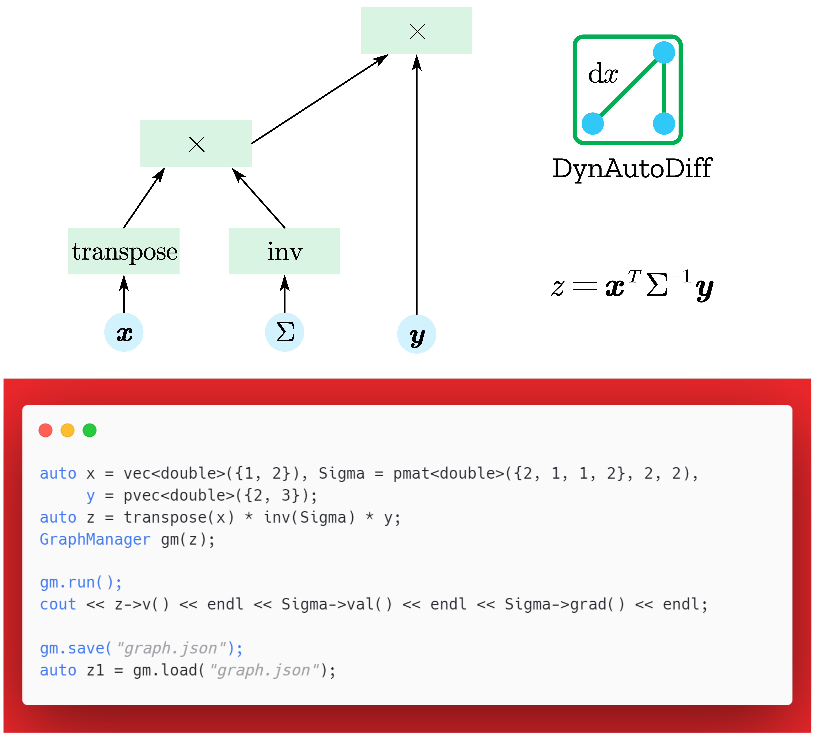

# DynAutoDiff - A C++ 20 Header-Only Dynamic Automatic Differential Library for Statistics and ML



## Introduction 

### Why Another Auto-Diff library?

There have been many excellent automatic differential libraries: `autodiff`, `Adept`, `stan-math`, `pytorch`, `tensorflow`, `FastAD`... But none of them servers as my ideal:

1. Some are too big (`pytorch`, `tensorflow`) and depend on many external libraries. A series problem is that these libraries may be conflict with other libraries which I need due to linking problems. One example is `pytorch` can't be linked together with `Ceres` (an optimizing library) or there will be segmentation fault.

2. Some lacking abilities to deal with matrix differential (e.g. *matrix inverse*, *det*, ...). As far as I know, except `FastAD` and `stan-math`, other libraries don't deal with matrix differential.

3. `stan-math` has bad documentations. I can't even successfully run an example. Also it depends on TBB and SUNDIALS which I seldom need.

4. `FastAD` is inconvenient. It uses expression template technique and is better for static expressions. It's hard to manipulate expressions programmatically. However it's fast.

That's why I decide to write an automatic differential library by myself. The design of this library is inspired by `pytorch` and `FastAD`. **Dynamic** is the first goal, so naturally it should be slower than `FastAD`. If you are sensitive to speed, I suggest you to try `FastAD`.

### Core Idea

Data is represented by a matrix: a scalar is a $1\times1$ matrix, a column is a $n\times 1$ matrix. The matrix is store as `Eigen::Map` to support both automatic memory management or passing external storage.

The type for variable is `Var<T=double>`. It stores value and gradient data, evaluation functor, gradient functor. But the real type that involved in expressions is `shared_ptr<Var<T>>`. When an expression `x+y` is created, a graph is created and no computation is done.

The actual computation is stared when user call `eval()` and then call `backward()` for gradient computation. In this stage, evaluation and gradient functors will be called.

There is a `GraphManager` that helps manage a graph. For example it can track all previous nodes given a final node. It can clear gradient data (before a fresh evaluation is begin, gradient data should be set to zero). A variable has a flag `_evaluated` to avoid repeating computation. This flag can also be cleared by `GraphManager`.


## Usage and Examples

### Installation

First clone this project:
```
git clone https://github.com/kilasuelika/DynAutoDiff.git
```

Then run the hello world example (see bellow):
```
cmake .
make
```

The main part of this library is a header-only library and depend on `Eigen, boost.json, ` which are also header-only libraries. So just copy the header files folder `DynAutoDiff` into your projects. You compiler should support **c++20** (`constexpr, <concepts>, <numbers> ...` are used).

There are also a series wrapper classes for `ceres` (CeresOptimizer.hpp), `NLopt` (nloptoptimizer.hpp). They are not included in `DynAutoDiff.hpp`. To use these, you need to install them by yourselves.

If you want to run tests, then you need `boost`.

If you want to run some examples, then you need to install more. For example the example *ceres_neural_network* requires `ceres` or more.

### A Hello World Example

```cpp
#include "DynAutoDiff/DynAutoDiff.hpp"

using namespace std;
using namespace DynAutoDiff;

int main() {
    // Create variables and expressions.
    auto x = vec<double>({1, 2}), Sigma = pmat<double>({2, 1, 1, 2}, 2, 2),
         y = pvec<double>({2, 3});
    auto z = transpose(x) * inv(Sigma) * y;
    GraphManager gm(z);

    // Run automatic differential.
    gm.run();
    cout << z->v() << endl << Sigma->val() << endl << Sigma->grad() << endl;

    // Save and load.
    gm.save("graph.json");
    auto z1 = gm.load("graph.json");
};
```

### GMM Model

The full code is in `examples/ceres_GMM`:

```cpp
auto X = std::make_shared<Var<>>("../../test/gmm_datat5000_10.txt");

auto I = cmat(10, 10);
*I = TMat<>::Identity(10, 10); //Set data of I matrix.

auto mu1 = prowvec<double>({10, 10, 10, 10, 10, 10, 10, 10, 10, 10});
auto sigma1 = pvec<double>( {});
auto mu2 = prowvec<double>({-10, -10, -10, -10, -10, -10, -10, -10, -10, -10});
auto sigma2 = pvec<double>( {});

auto w1 = psca(0.5);
auto p = sigmoid(w1);

auto S1 = rsdot(ivecl(sigma1)) + I; //LL^T+I for positive definite matrices.
auto S2 = rsdot(ivecl(sigma2)) + I;

auto Xmu1 = offset(X, -mu1), Xmu2 = offset(X, -mu2);
auto p1v = (1.0 / sqrt(pow(2 * numbers::pi, 10))) / sqrt(det(S1)) *
               exp(-0.5 * diag(Xmu1 * inv(S1), transpose(Xmu1)));
auto p2v = (1.0 / sqrt(pow(2 * numbers::pi, 10))) / sqrt(det(S2)) *
               exp(-0.5 * diag(Xmu2 * inv(S2), transpose(Xmu2)));
auto ll = -sum(ln(p * p1v + (1 - p) * p2v));
GraphManager<> gm(ll);
```


### Using Distributions and Loss Functions


## Reference Guide

### Conventions and Be Careful

1. `Eigen` uses `ColumnMajor` by default. But it's a little counter-intuitive. So `RowMajor` is used by this library. The internal type used is:
```cpp
template <typename T = double>
using TMat = Eigen::Matrix<T, Eigen::Dynamic, Eigen::Dynamic, Eigen::RowMajor>;
```
2. When I say *vector*, it's default to be a column vector. Use column vectors as much as possibles to avoid confusing.
3. The default template element type are `double`, but sometime you need to explicitly specify it:
```cpp
auto x=rowvec({1,2,3}) // Warning: element will be int
auto x=rowvec<double>({1,2,3})  //Correct.
```
1. The initial values and gradients are guaranteed to be 0 for automatically allocated memory. Sometimes this may be problematic. For example, when optimizing, the target function may be undefined for 0 inputs. You must provide initial values at this situation.
2. The default reduction method for loss functions is **Sum**, not mean.
3. There will be range checks for `v(), g()` which are used to get value and gradient by index.

### Initializing Variables

#### Automatic memory management

There are a series of convinence functions for creating specific size variables: `mat, vec, rowvec, sca`. Each one has a c-version (constant, thus `requires_grad=false`) and p-version  (parameter, thus `requires_grad=true`).

1. Only specify size, allo values are initialized to be 0s:

```cpp
auto S=cmat(2,2); //2*2 size matrix
auto S=pmat(2,2); //2*2 size parameter matrix
auto v=vec(5); //column vector
auto s=csca(); // scalar.
```
2. Pass data when crating a variable:

```cpp
auto S=cmat<double>({1,2,3,1}, 2, 2); //Don't forget to set variable type to double.
auto S=cmat({1.1, 2.0, 3.0, 3.9}, 2, 2); //double type.
auto v=vec<double>({1,2,3}); //No need to set size for vector. 3*1 vector.
```

#### Passing External Storage

You can pass data pointers when initilizing:
```cpp
auto S=std::make_shared<Var<T=double>>(T* val, T* gard, rows, cols);
```

Or you can `bind` later:

```cpp
auto S=cmat(2,2);
S->bind(T* val, T* grad, rows, cols);
```

#### Reading Data from File
```
auto x=std::make_shared<Var<>>("data.txt", requires_grad=false);
```
can create a variable with values read from "data.txt". It should be a tab-delimited file without header row, not csv format. Shape is automatically decided. 

### Expressions and Operators

#### Basic Math Functions

1. `+, -, *, /`: *+, -, /* are element-wise operation (one of them can be a scalar). *\** is matrix product (or scalar-matrix product). `eprod(X,Y)`: element wise product, *X,Y* must have the same shape (thus not a scalar and a matrix). `offset(X, x)`: *X* is a matrix, *x* is a column or row vector. If *x* is a column vector, then add it to each column of *X* (thus shape must match), vice versa. `scale(X, x)`, like *offset*, but now is element-wise times.
1. Element-wise functions: `exp`, `ln`, `sqrt`,`pow(x, d)`, `sin`, `cos`,`tan`,`sinh`, `cosh`, `tanh`, `sigmoid`, `relu`.
2. `lpnorm(X, Dim=-1)`: `Dim=-1 | 0 | 1`, `-1`(all, return a scalar), `0` (norm of each row, return a column vector), `1` (return a row vector).
3. `sum(X, Dim=-1)`.

#### Matrix Operators

1. `inv(X)`: matrix inverse $X^{-1}$.
2. `transpose(X)`: matrix transpose $X^T$.
3. `trace(X)`: trace of a matrix. `trace(X, Y)`: trace of $XY$.
4. `det(X), logdet(X)`: determinant and natural log determinant.
5. 
6. `lsdot(X)`: left-self-dot $XX^T$. `rsdot(X)`: right-self-dot $X^TX$. They can be used to construct a semi-positive definitive matrix.
7. `diag(X)`: extract diagonal elements to form a column vector. `diag(X, Y)`: $\text{diag}(XY)$. `diagonal(v)`: construct a diagonal matrix by a vector (both column and row).
8. `vec(X)`: stack columns to form a column vector. `vech(X)`: stack columns of lower part to form a column vector. $X$ must be a square matrix. `ivech(v)`: unstack a vector to form a symmetric matrix. For example, if *v* has size 6, then the result will be a $2\times 2$ symmetric matrix ($\frac{(1+3)\times 3}{2}=6$).
This is usefull when you want to optimize a symmetric matrix.
$$
[1,2,3,4,5,6]\implies \begin{bmatrix}
1 & 2 &3  \\
2 & 4 & 5\\
3 & 5 & 6
\end{bmatrix}
$$

Note $1,2,3$ forms the first column (or the first row).
`ivecl(v)`: like *ivech(v)* but leave upper part to be zero (thus return a lower triangular matrix). `ivecu(v)`: leave lower part to be zero.

$$
\text{ivecl(v)}: [1,2,3,4,5,6]\implies \begin{bmatrix}
1 & 0 & 0  \\
2 & 4 & 0\\
3 & 5 & 6
\end{bmatrix}
\text{ivecu(v)}: [1,2,3,4,5,6]\implies \begin{bmatrix}
1 & 2 & 3  \\
0 & 4 & 5\\
0 & 0 & 6
\end{bmatrix}
$$

f
#### Distributions

Only computes **log density**. For example,

```cpp
ln_mvnormal_den(X, mu, Sigma); //default None reduction.
ln_mvnormal_den(X, cvec(5), Sigma); // mu is a zero vector.
ln_mvnormal_den(X, mu, Sigma, DynAutoDiff::Mean); //mean reduction.
```

computes log multi-variate normal density. Arguments `X` is a data matrix( for multivariate distributions) or a column vector( for univariate distributions), each row represents a sample.

The function parameter `reduction=DynAutoDiff::None | Mean | Sum` is used to control reduction, default is `Sum` (then return a scalar). If `None`, return a column vector. The template parameter `true` is used to control whether to include constants. default is `false` which is not to include constants.


1. `ln_mvnormal_den(X,mu,Sigma)`: multivariate normal, which has been introduced above.
2. `ln_normal_den(X,mu, sigma)`: univariate normal. `X` must be a column vector.
3. `ln_mvt_den(X, mu, Sigma, nu)`: multivariate $t$ distribution. *nu* is a scalar.
4. `ln_t_den(X, mu, sigma, nu)`: univariate $t$ distribution. `mu, sigma, nu` are scalars.

#### Loss Functions

Remember the input order is `(input, target)`. The loss function has a template parameter `Reduction`, whose allowed values are `Reduction::None, Reduction::Sum, Reduction::Mean`. The default is `Sum`. Usage:

```
auto loss = binary_cross_entropy(sigmoid(X * theta + c), y); //Logistic regression.
```

1. `binary_cross_entropy(input, taret)`.
2. `mse_loss(input,target)`.


### Evaluation and Backward

To carry out a fresh computation, use

```cpp
GraphManager<> gm(y); //y is a variable.
gm.run(clear_leaf_grad=true);
```

It's equivalent to:

```cpp
zero_all(clear_leaf_grad); // Clear all gradient.
_root->eval();
_root->backward();
```

If `clear_leaf_grad=true`, then it will also clear gradient of leaf nodes  (parameters).

Sometimes you want to loop over samples and accumualate gradients on leaf nodes. Then just use

```
gm.run(false);
```

### GraphManager

#### Reallocate Contiguous Memory

Sometimes you want the memory of parameter nodes to be contiguous. Then you can use:

```cpp
auto [val, grad]& = gm.auto_bind_parm();
```

Here `val, grad` both are column vectors with type `TMap<T>`. 